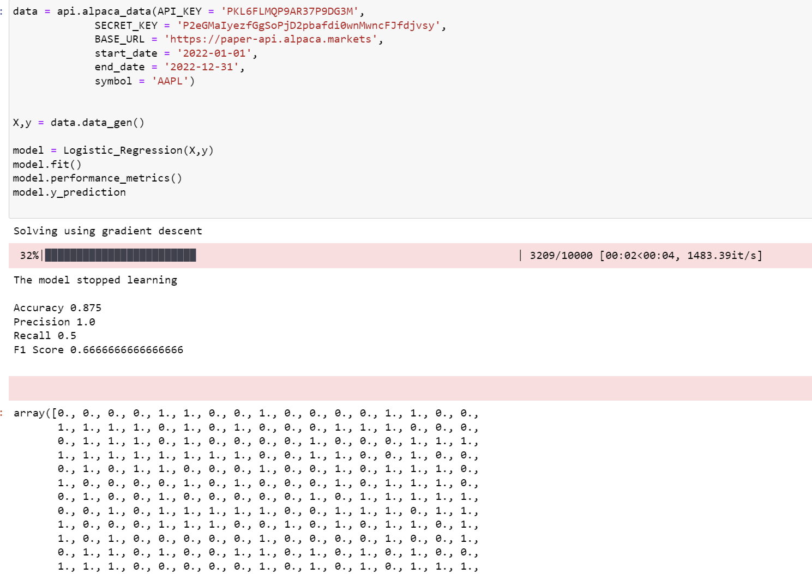

# Alpaca_pred
This package is used to predict wheather there is an increase in the close price of stock using Logistic Regression and Neural Networks.

## Organization
### data_import.py: 
This module is used to import data from Alpaca API and includes data preparation for prediction. It implements a class called alpaca_data() with data_gen() method as an important method.

### LogisticReg.py: 
This module implements the logistic regression machine learning algorithm. It uses a class Logistic_Regression with fit (), predict(), and performance_metrics () methods.

### ANN.py: 
This module implements the machine learning algorithm of Neural Networks using the class NeuralNetwork with train (), predict () methods.

### run_algo.py:
This module import data and run the algorithms by importing classes and methods from other modules. It's is way to test the package.

### unit_test.py: 
This module implements the several unit tests built for small operations of the algorithms

## Classes, methods, and Functions
### data_import:
    class: alpaca_data()
    methods: data_import(), target_variable(), data_gen()
    
### LogisticReg:
    class: Logistic_Regression()
    methods: data_split(), normalize_train(), normalize_test(), add_X0(), sigmoid(), cost_Function(), gradient(), predict(), predict_prob(), gradient_Descent(), fit(), performance_metrics()
    
### ANN:
    class: NeuralNetwork
    methods: sigmiod(), relu(), forward(), sigmoid_derivative(), relu_derivative(), backward(), optimize(), train(), predict()
    
    
    
## Usage/Example





```python

```
